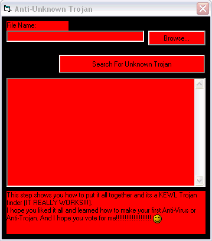



## EASY Step\-by\-Step ANTIVIRUS or ANTITROJAN

### Description

Grr....They took down my last upload of this..

But here it is again! This is 5 easy steps to make ur own kewl anti-trojan or anti-virus.
 
### More Info
 

             |
---                |---
**Submitted On**   |2003-11-02 12:08:26
**By**             |[Evil\_Bob](https://github.com/Planet-Source-Code/PSCIndex/blob/master/ByAuthor/evil-bob.md)
**Level**          |Advanced
**User Rating**    |4.9 (39 globes from 8 users)
**Compatibility**  |VB 6\.0
**Category**       |[Miscellaneous](https://github.com/Planet-Source-Code/PSCIndex/blob/master/ByCategory/miscellaneous__1-1.md)
**World**          |[Visual Basic](https://github.com/Planet-Source-Code/PSCIndex/blob/master/ByWorld/visual-basic.md)
**Archive File**   |[EASY\_Step\-1669371182003\.zip](https://github.com/Planet-Source-Code/evil-bob-easy-step-by-step-antivirus-or-antitrojan__1-49753/archive/master.zip)

